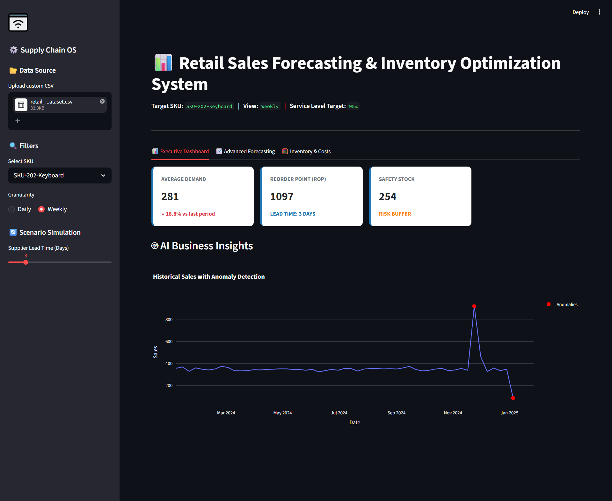
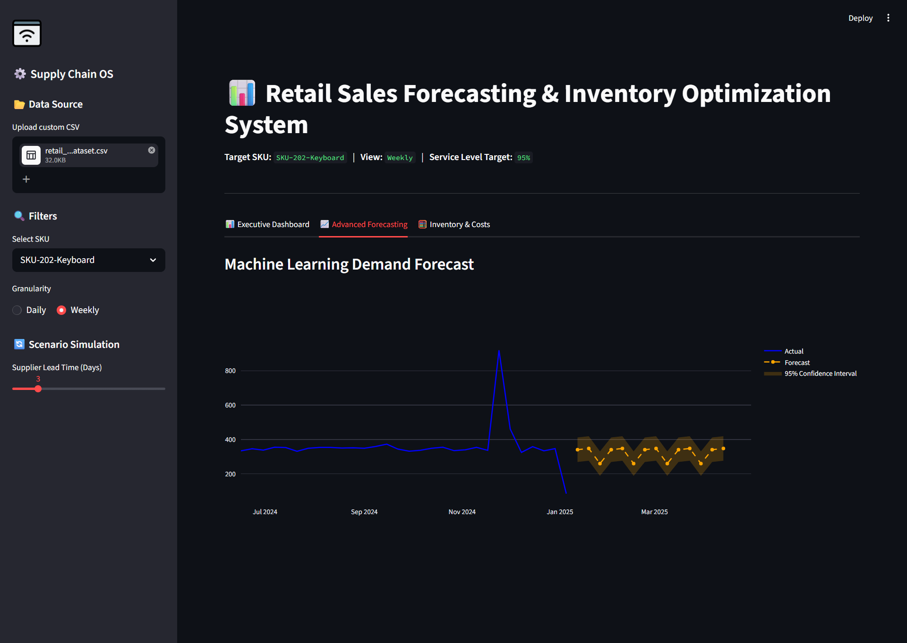
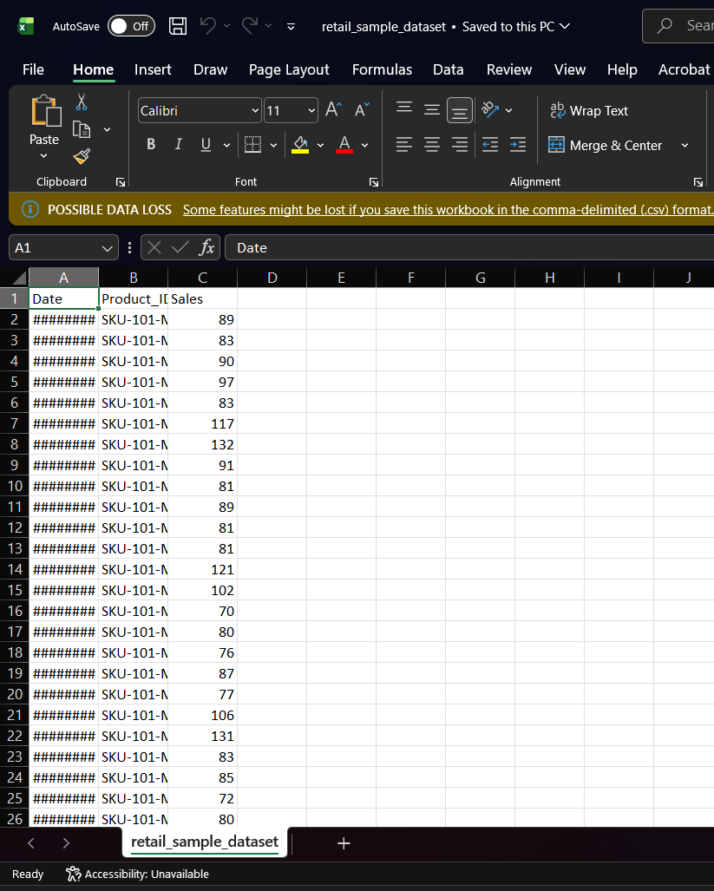

# 📊 Retail Sales Forecasting & Inventory Optimization System


## 📖 Project Overview
The **Retail Sales Forecasting & Inventory Optimization System** is an enterprise-grade analytics application designed to solve one of the most critical challenges in the retail supply chain: balancing stock levels to meet customer demand without overstocking. 

By combining **Machine Learning (Demand Forecasting)** with **Stochastic Inventory Theory (Safety Stock & Reorder Points)**, this interactive dashboard empowers supply chain managers to make data-driven purchasing decisions, visualize anomalies, and simulate market shocks in real-time.

---

## 🎯 Problem Statement & Business Value
**The Problem:** Retailers lose billions annually due to two massive inefficiencies:
1. **Stockouts:** Running out of inventory, leading to lost sales and damaged customer loyalty.
2. **Overstocking:** Buying too much inventory, leading to high warehousing costs, dead stock, and capital tie-up.

**The Business Value:** This system minimizes these risks by answering three critical business questions:
- *What will our demand be next week?* (Predictive Analytics)
- *When exactly should we order more?* (Reorder Point Logic)
- *How much extra buffer do we need for uncertainty?* (Safety Stock Modeling)

## 🏢 Industry Relevance
Companies like **Amazon, Walmart, D-Mart, and Reliance Retail** rely heavily on Demand Sensing and Automated Replenishment systems. This project mimics the core architecture of these enterprise systems, proving an understanding of both the **Data Science** and the underlying **Business/Supply Chain Operations**.

---

## 📸 System Screenshots

### 1. Executive Dashboard & Anomaly Detection
*Displays KPI metrics, growth trends, and automatically flags historical sales anomalies (e.g., Black Friday spikes) using Z-Score statistical thresholds.*


### 2. Machine Learning Demand Forecast
*Visualizes a 14-day future demand forecast generated by a Random Forest Regressor, complete with a 95% Statistical Confidence Interval band.*


### 3. Inventory Health & Cost Analysis
*A live simulation gauge calculating current stock health, automated strategic action plans, and simulated holding vs. stockout costs.*


### 4. Sample Data Ingestion
*System seamlessly ingests daily SKU-level transaction data, capable of handling custom user CSV uploads with strict validation.*


---

## 🛠️ Tech Stack
* **Language:** Python 3.9+
* **Data Processing & Math:** Pandas, NumPy, SciPy
* **Machine Learning:** Scikit-Learn (Random Forest Regressor)
* **Frontend & UI:** Streamlit (Custom HTML/CSS injected)
* **Visualizations:** Plotly Express, Plotly Graph Objects (Interactive web charts)

---

## 🏗️ System Architecture & Workflow
1. **Data Ingestion Layer:** Accepts synthetic or user-uploaded CSV data, validating schema requirements.
2. **Preprocessing & Feature Engineering:** Generates lag features, extracts date parts (seasonality), and calculates statistical variance.
3. **Modeling Layer:** Trains a live `RandomForestRegressor` on the selected SKU to predict future demand based on historical lags.
4. **Operations Engine:** Calculates `Safety Stock` and `Reorder Points (ROP)` using standard service-level formulas ($Z \times \sigma \times \sqrt{L}$).
5. **Presentation Layer:** Renders the interactive Streamlit UI, providing dynamic scenario simulation and automated text-based business recommendations.

### 📂 Folder Structure
```text
Retail-Inventory-System/
│
├── data/
│   ├── raw_sales.csv            # Synthetic generated dataset
│   └── retail_sample_dataset.csv # Advanced test dataset
├── src/
│   ├── data_loader.py           # Script to generate mock retail data
│   └── inventory_manager.py     # Supply chain mathematical logic
├── app/
│   └── main_dashboard.py        # Core Streamlit application (UI + ML)
├── outputs/                     # Contains project screenshots for documentation
│   ├── scr 1.png
│   ├── scr 2.png
│   ├── scr 3.jpg
│   └── scr 4.png
├── requirements.txt             # Python dependencies
├── .gitignore                   # Ignored files for clean repo
└── README.md                    # Project documentation